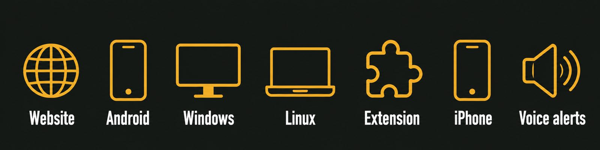
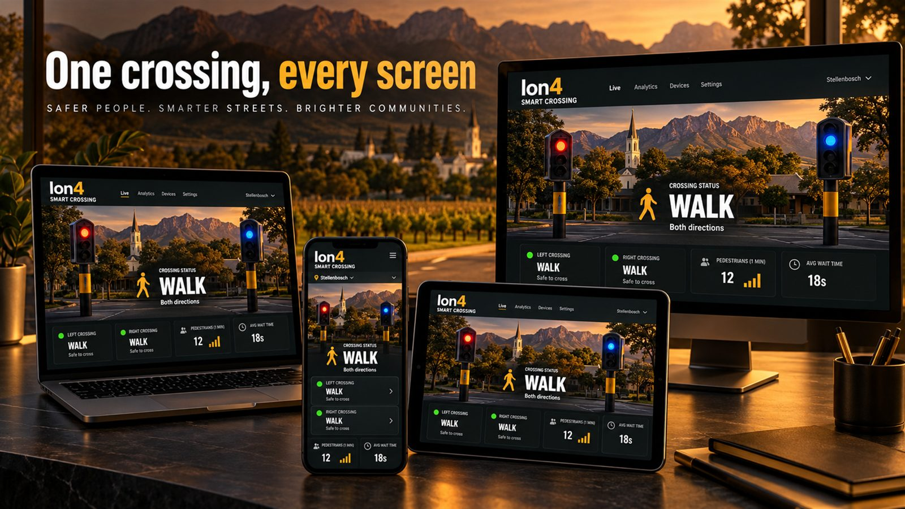
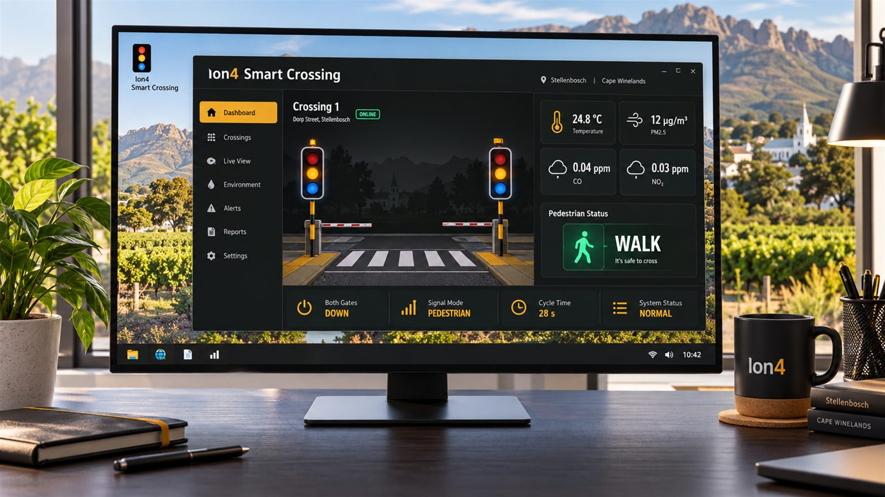
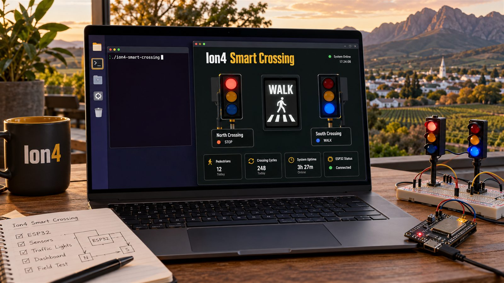
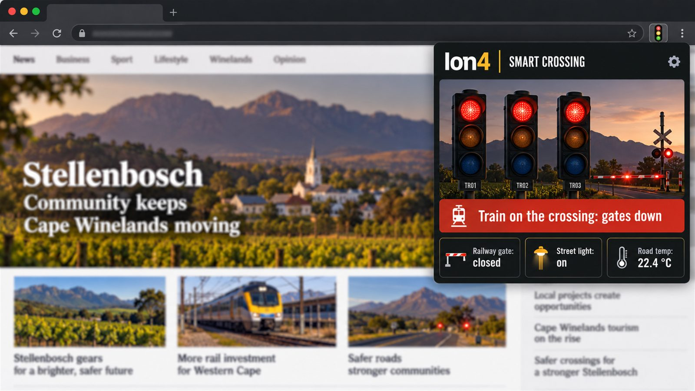
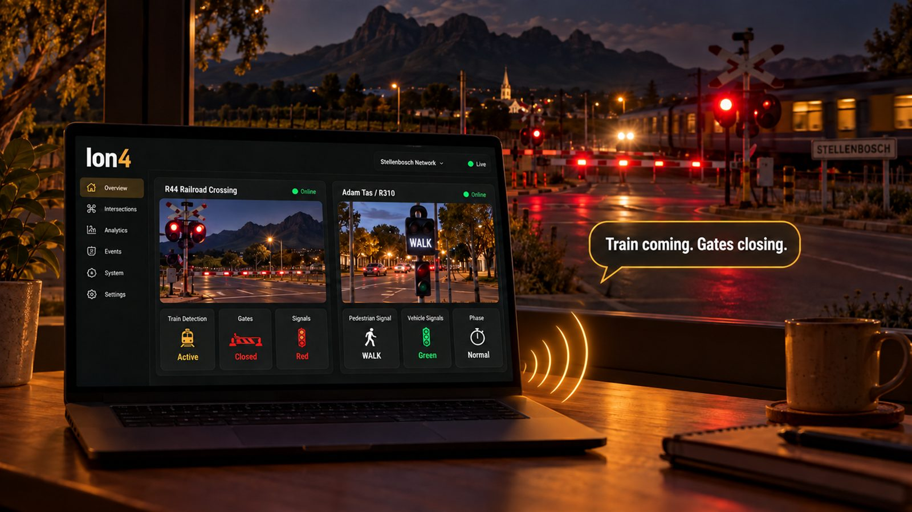

# Ion4 Smart Crossing apps

The live Ion4 crossing dashboard as an app, with voice alerts: "Train coming. Gates closing."
Live site: https://ion4.hnkiot.com

## Get the app

| Platform | How |
|---|---|
| Windows | [Download the installer](https://github.com/henockhnk092-dot/ion4-smart-crossing-apps/releases/latest) (`Ion4-Smart-Crossing-Setup.exe`) |
| Linux (x64) | [Download the tar.gz](https://github.com/henockhnk092-dot/ion4-smart-crossing-apps/releases/latest) |
| Android | APK on the [Download page](https://ion4.hnkiot.com/#download) |
| Browser extension | Chrome, Edge, Brave, Opera: zip on the [Download page](https://ion4.hnkiot.com/#download) |
| iPhone, iPad, Mac, Chromebook | Open the site and add it to your home screen or dock |

## Screens

| Windows | Linux |
|---|---|
|  |  |
| **Browser extension** | **Voice announcer** |
|  |  |

The pictures are concept illustrations made with AI.

By HNK IoT Solutions, https://hnkiot.com
